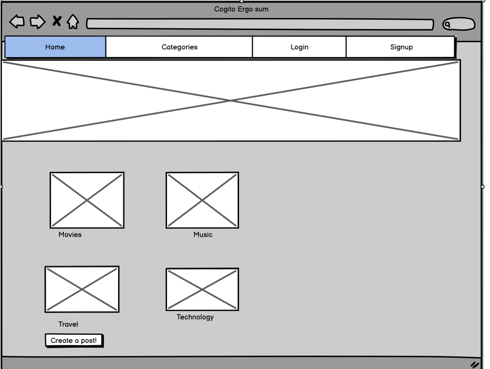
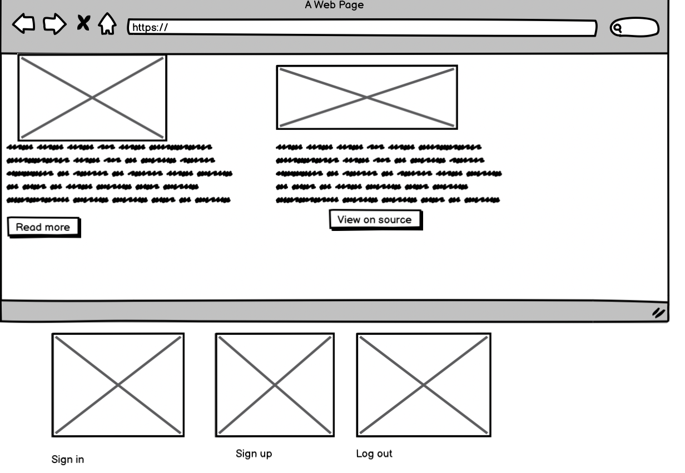
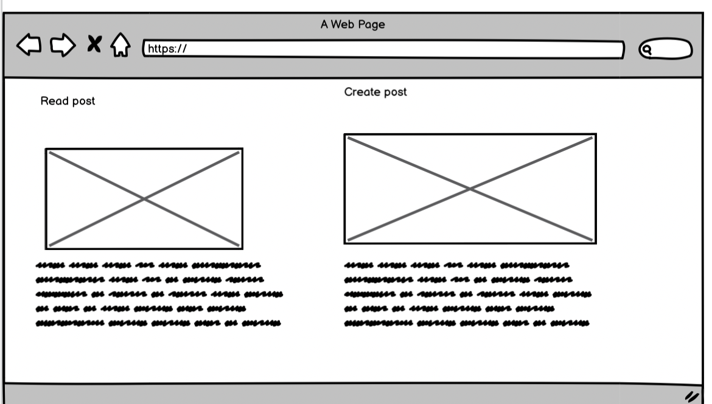
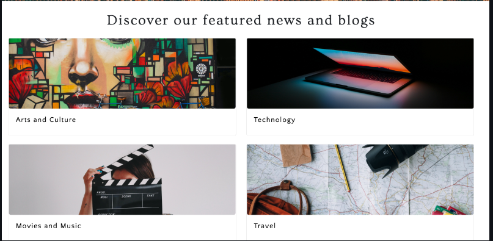
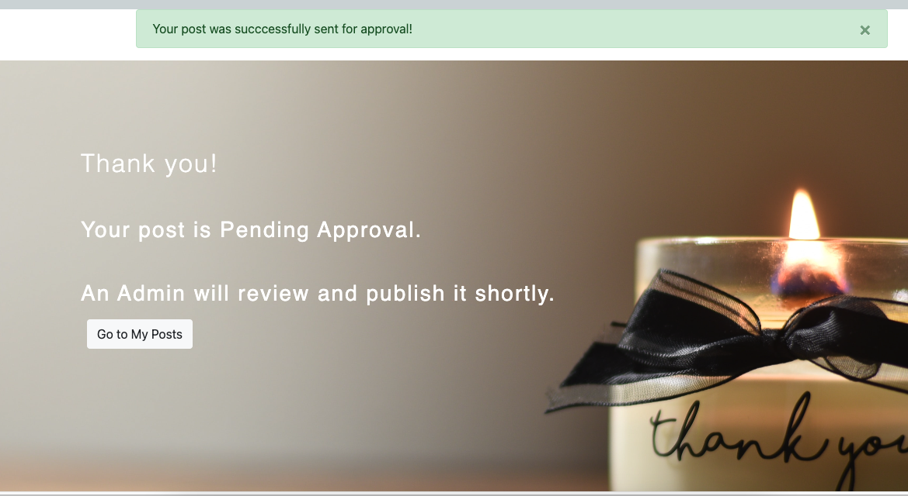
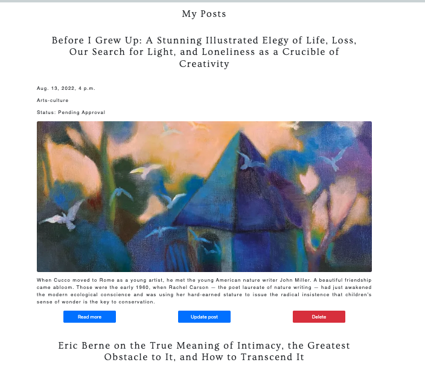
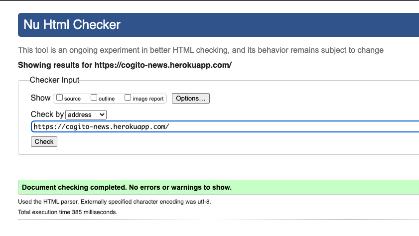
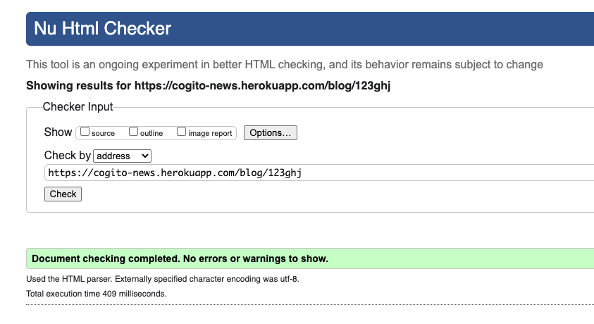
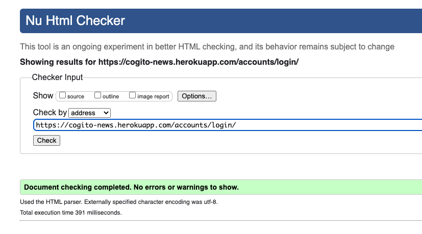

# **Cogito, ergo sum**

You can view the live website [here](https://cogito-news.herokuapp.com/).

## **About this project**
This is a full stack website build uinsg Django, Python, Postgres SQL, Bootstrap, Javascript, HTML and CSS.
This project allows users to sign up and login to the website, create their own posts and chose a categpry for their posts. Users are also able to read and like posts from other users. I've implemented a news API so that users can view news around the world based on 4 categories: Arts and Culture, Technology, Movies and Music and Travel. 
This website is for all those who are interested in the categories oulined above and who want to discover news from around the world at the same time as reading blogs written by users. 

## **UX design**
In building this website, I've followed the principles of UX design and implemented features that are responsive, are visually pleasing and overall create a good experience for the User.

## **User Stories**
The following User Stories have been used to organise and create this project

- **As a Site User I can like posts so that I can show my appreciation for the post** 
- **As a User I can easily navigate the website so that I can go from one page to another**
- **As a Site User I can click on View more to open a post so that I can read what's in it**
- **As a Site User I can sign up for an account so that I can like posts and create my own posts**
- **As a Site User I can be informed of the status of my post after creating and updatimg it so that I know if my post was published on the website**
- **As a Site Admin I can update and delete posts so that I can moderate and website content**
- **As a Site Admin I can create drafts so that I can finish my writing later**
- **As a Site Admin I can create a Superuser so that I can manage posts and approve comments**
- **As a Site User I can view a list of posts that are available on the website so that I can select one to read**
- **As a Site User / Admin I can view the likes on each post so that I can see which are the most popular posts**
- **As a Site user / Site Admin I can select a category on the home page so that I can browse news from various sources**
- **As a Site User I can see the news from the world and click on View on Source to read the full story at its source**
- **As a **User** I can see that I'm signed in so that ** I can see my status on the website and log out from the website**
- **As a site user I receive a thank you page when I post a post so that I know my post was received and an admin is looking at the post**
-**As a site user I can access the posts I created under My posts, so I can read more, update and delete a post**

## Wireframes 
-**Home page**

-**Read more / View on source / Sign in / Log out / Sign up**

-**Read post / Create post**

## Main Features and respective manual testing

I used the MVP model on my website. I have used a mix of Simple Tests in Django for the main features and manual testing for all features. 

- **Header image and Navigation Bar** 
Designed mainly using Bootstrap and CSS, the navbar is responsive on all devices, featuring a collapsible menu and a hamburger style menu on smaller devices like tablets and phones.
You can navigate from the navbar to all the main pages on the website. 
When User is not logged in, they will see options to Sign in and Register.

- **Header image and Navigation Bar - User is logged in** 
When User is logged in, they will see additional options to Create post, My posts and Log out. 

- **Sign in / Sign up / Logout**
When user wants to log, log out and sign up - user will see a responsive form to do so

- **Featured news and blogs**
User can access the 4 main categories from the home page

- **Write a post**
Users need to create an account that enables them to write posts

- **Write post call to action post on the Home page**

- **Categories and blogs page**
User can navigate to all categories from the categories page and User can read the blogs in a new page

- **Thanks message after creating post**

User receices a message page and message box informing them that the post is pending approval and will be reviewed and published shortly by an Admin. 

- **Thanks message after updating post**

User receices a message page and message box informing them that the updated post is pending approval and will be reviewed and published shortly by an Admin. 

- **Message before and after deleting a post**
User is asked to confirm via a message box wether they wish to delete the post. 
After deleting a post, User receives a confirmation message that the post was deleted. 
User can delete both Pending approval and Published posts. 

- **Message after signing up**
After, signing up User is sent to a thank you page with a button that goes to the Home page.

- **Message after Sign in and Log out**

- **View My posts**
My Posts page that shows all posts a User/Admin created including respective status - published or pending approval.
Each post is showing the excerpt - you can click on Read more - to read the full post, Update post to update the post and Delete to delete the post.

- **Post detail page**
When User clicks on Read more from the News Categories page or on the My Posts page - they are sent to the post detail page where they can read the post in full. 

- **Django admin panel**
Site Superuser can login to django and see all their posts and their statuses.

- **Django change post**
Site super User can read, delete and edit the posts from users 

## Design and tipography

I kept the design clean and elegant, tipography is Quattrocento Sans', fall back on Sans-Serif and Ovo with fallback on Serif.

## **Technologies**
#### **Languages Used**
- [HTML](https://en.wikipedia.org/wiki/HTML5) 
- [CSS](https://en.wikipedia.org/wiki/CSS)
- [Django](https://www.djangoproject.com/)
- [Bootstrap](https://getbootstrap.com/)
- [Javascript](https://www.javascript.com/)
- [News API](https://newsapi.org/)
- [Heroku](https://dashboard.heroku.com/apps)

#### **Frameworks, Libraries & Programs Used**

1. [Google Fonts](https://fonts.google.com/) was used to import fonts 'Montserrat'and 'Arima Madurai' that are used throughout the website. 

2. [Adobe color](https://color.adobe.com/mythemes) was used to extract the colors used on the website. 
3. [Git](https://git-scm.com/) was used to used to edit the code on the Gitpod terminal, to commit to Git and Push to GitHub.

4. [GitHub](https://github.com/) is used to store the project code after being pushed from Git. 

## Testing

### Validator testing 
### HTML 
All the below pages don't have any errors or issues
- Home page

- Post detail page

- Create post page

- Logout page

- Login page

- Sign-up page

### CSS

### Python
Python code was validated using Pep8 validator online.
Most errors were around the long code lines, i've left these as they are they don't impede with website's core functionality. 

#### Lighthouse report
The website passed the Lighthouse report for all pages

### **Responsiveness Test**
- I used media queries to make my website responsive and can confirm that the website is responsive on all the screen sizes and devices I used as well as various browsers as listed below. 

### **Browser compatibility**
- I tested my website on various browsers and screen sizes as shown below. The website works well and is responsive on monitors and laptop screens. 
- I also tested the website using Chrome dev tools device toolbar, by adjusting the size of the window and by selecting the pre-set devices available there. 
- All links are clickable and open in a new tab. 
- Pictures resize accurately and are clear, nor blurry or pixelated. 

#### Browsers
- Chrome
- Microsoft Edge 
- Internet Explorer
- Mozilla Firefox
- Safari

#### Devices:
- Desktop
- Laptop
- Samsung S10 Plus
- Huawei P30
- iPhone 8
- iPhone XS
- Samsung tablet
- Lenovo tablet

## Known Bugs 

Another feature I've implemented is delete confirmation modal with Jquery.
The code is on the My posts page - when deleting a post the modal should pop up asking the User to confirm if they indeed want to delete the post.
The code works in the console but not on the website itself. I've left the code on my website for reference. 

## **Deployment**

This project was deployed using Github and Heroku

### Create a repository on Github
You can create a repository on Github using these instructions [Creating a new repository - Github](https://docs.github.com/en/repositories/creating-and-managing-repositories/creating-a-new-repository)

### Deployment on Heroku

I followed Code Institute's [Django Blog Cheat Sheet](https://codeinstitute.s3.amazonaws.com/fst/Django%20Blog%20Cheat%20Sheet%20v1.pdf) steps to create and deploy the project on Heroku 

This project was deployed on Heroku using these steps:

1. Install Django and supporting libraries
2. Log in to Heroku and create a new app.
3. Attach the heroku-postgres add-on
4. Prepare environment and settings.py file
5. Get the static and media files stored on Cloudinary
6. Complete the config vars section
7. Link Heroku and GitHub accounts together
8. Select the Github repo that you use for the app and give it a name
9. Before the final Deployement: Remove the "DISABLE_COLLECTSTATIC" from Heroku Config vars, and Change Debug to "False" in settings.py
10. Click on deploy.

### Clone a Github repository using these steps:
1. On GitHub, navigate to the main page of the repository.
2. Above the list of files, click the Code button.
3. To clone the repository using HTTPS, under "Clone with HTTPS", click the clone symbol. To clone the repository using an SSH key, including a certificate issued by your organization's SSH certificate authority, click Use SSH, then click the clone symbol next to it. To clone a repository using GitHub CLI, click Use GitHub CLI, then click the same clone symbol .
4. Open Git Bash and change the current working directory to the location where you want the cloned directory.
5. Type git clone, and then paste the URL you copied earlier.
6. You will see a message confirmation that the command was successul.

## **Credits**

### **Media**
All media from my website were downloaded with permission from [Unsplash](https://unsplash.com/s/photos/thank-you?orientation=landscape)

### **Code inspiration**
1. Change navbar button color [StackOverflow](https://stackoverflow.com/questions/42586729/how-can-i-change-the-bootstrap-4-navbar-button-icon-color)
2. Bootstrap Mdn Form styling [Bootstrao Mdn](https://mdbootstrap.com/docs/standard/extended/registration/)
3. News API Tutorial [Django Project: Build News App | From Scratch](https://www.youtube.com/watch?v=Mh69OwfeDkA)

## Acknowledgements
My mentor for feedback and guiding me throughout the process and everyone at Code Institute who provided helpful tips along the way.  

